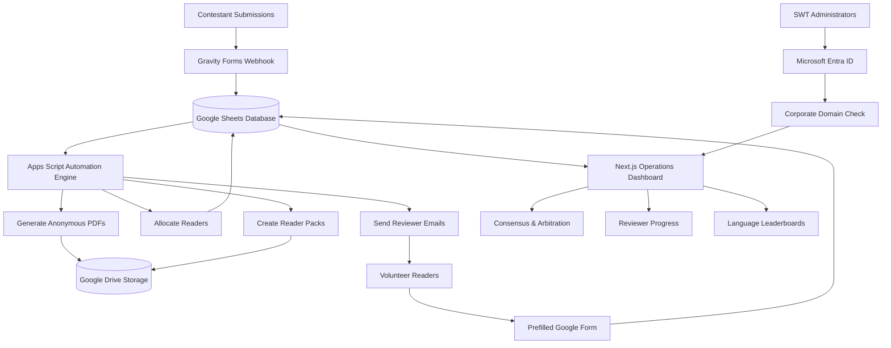
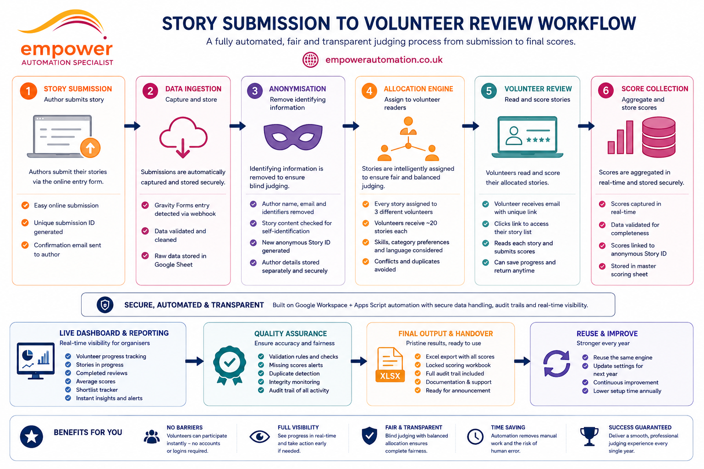
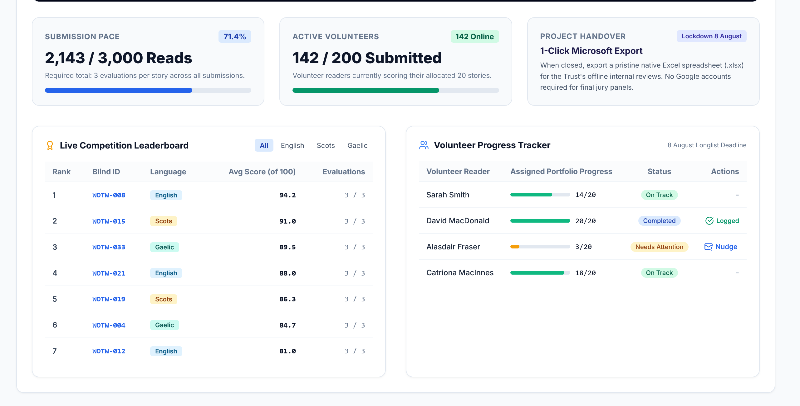
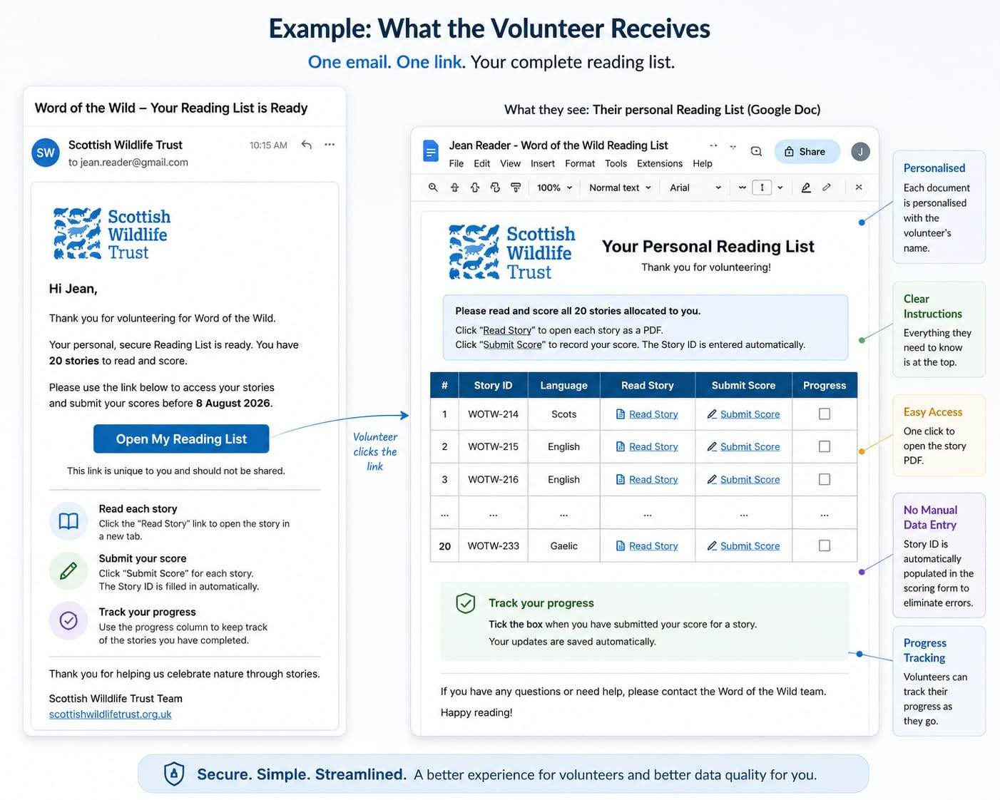
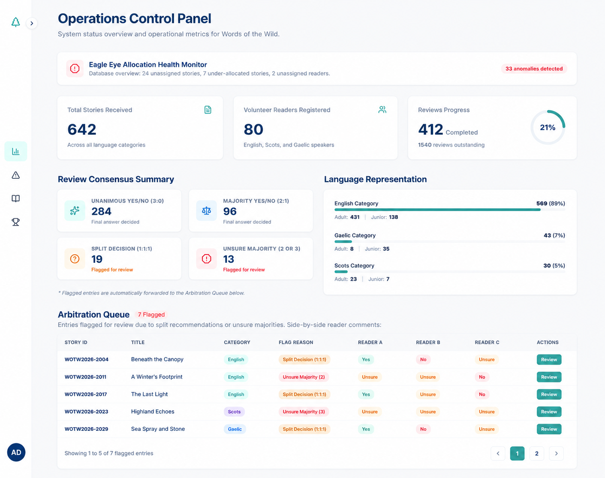
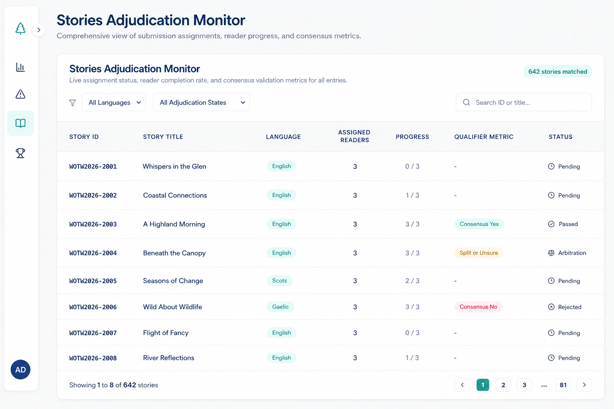
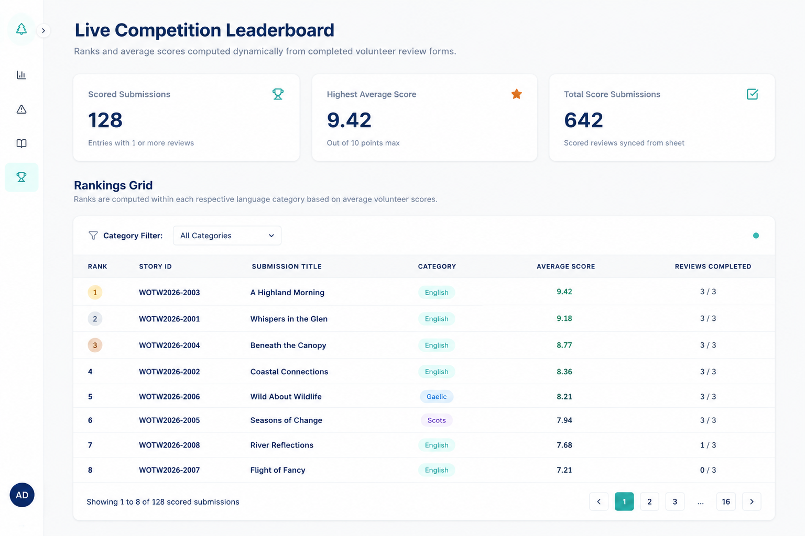
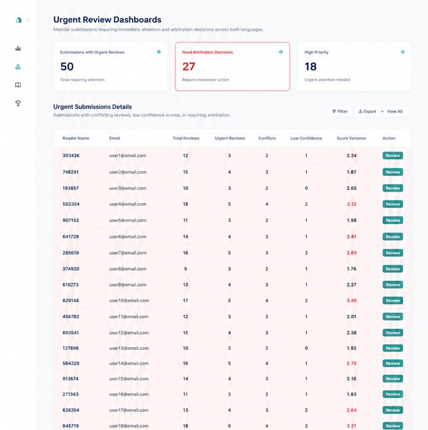

<div align="center">


# Words of the Wild - Operations Control Panel

</div>

> Secure, server-side operations dashboard built for the Scottish Wildlife Trust to manage a national writing competition across English, Scots and Gaelic.

> **Note**
>
> This repository is a public engineering case study. The production source code, deployment configuration and operational database remain in a private client repository.
>  > 
> **Confidentiality & Media Safeguards:** All visual diagrams, interface illustrations, and pipeline maps featured in this case study are **conceptual design mockups and system planning blueprints** created during requirements mapping. No active production databases, sensitive client credentials, or private volunteer data are exposed. All screenshots shown in this case study use representative demonstration data created to protect entrants, volunteers and client operations. No live submission content, personal information, private volunteer details, production credentials or active database records are exposed.

<p align="center">
  
</p>

## Overview

Words of the Wild is an operational platform developed for the Scottish Wildlife Trust to replace manual spreadsheet-driven competition management with a secure, automated workflow.

The platform manages the complete judging process, from receiving submissions through to anonymisation, reader allocation, scoring, arbitration and final rankings.

The solution combines **Google Apps Script**, **Google Workspace** and a **Next.js operations dashboard** into a secure server-side architecture with Microsoft Entra ID authentication.

<p align="center">
  
</p>

# Technology Stack


---

# System Architecture

The platform uses a background automation pipeline built in Google Apps Script, with Google Sheets acting as the operational database. The data is then consumed server-side by a secure Next.js dashboard.

The diagram below shows the full lifecycle of a submission, from entry through language-specific routing, reader pack generation, reviewer grading and administrator arbitration.




<p align="center">
  
</p>



<p align="center">
  
</p>

## Enterprise Security Model

To protect sensitive submission files, contact details and grading data, the application uses a dual-layer security model.

### 1. Microsoft Entra ID Tenant Locking

Authentication is managed through **NextAuth.js** using the Microsoft Entra ID provider.

Login requests are restricted to the Scottish Wildlife Trust's dedicated tenant. External organisations and personal Microsoft accounts (such as `@outlook.com` and `@hotmail.com`) are rejected before a user session is created.

<p align="center">
  
</p>

### 2. Corporate Domain Validation

Authentication alone is not considered sufficient.

After a successful Microsoft sign-in, a second server-side validation checks the authenticated email address.

Only users with an authorised `@scottishwildlifetrust.org.uk` account are permitted access. All other authenticated users are denied before the application loads.

<p align="center">
  
</p>

# Core Engineering Features

## Dynamic Reader Assignment & Language Prioritisation

Submissions are automatically categorised into:

- English
- Scots
- Gaelic

Because English-only readers cannot review Scots or Gaelic entries, the allocation engine prioritises bilingual readers before allocating English submissions.

The allocation engine also enforces the **three-reader fairness rule**, ensuring each story is assigned to three independent reviewers where capacity allows.



- Dynamic reader allocation with language prioritisation
- Three-reader fairness enforcement
- Proactive database integrity monitoring
- Anonymous document generation
- Automated Reader Pack assembly
- Prefilled reviewer feedback forms
- Story-level review progress monitoring
- Automatic consensus calculation
- Arbitration queue generation
- Reviewer performance and calibration analysis
- Language-specific competition leaderboards
- Secure Microsoft Entra ID authentication

## Proactive Operational Assurance

The Eagle Eye monitor automatically identifies allocation gaps and assignment inconsistencies.

Staff no longer need to manually cross-reference hundreds of story and reader records to verify that every submission has sufficient reviewer coverage.

## Transparent Adjudication

Every story can be traced from reader allocation through completed reviews, vote ratios, consensus status and arbitration.

Administrators can see not only the final decision, but the review evidence that produced it.

## Scalable Competition Oversight

Search, filtering, pagination and page windowing allow the platform to remain usable across more than 650 submissions and hundreds of review assignments.

## Earlier Intervention

Urgent-review indicators, inactive-reader tracking and story-level progress monitoring allow staff to address delays and anomalies while the reading period is still active rather than discovering them near the judging deadline.

<p align="center">
  
</p>

## Automated Reader Pack Assembly

Reader Packs are generated dynamically from a master Google Doc template.

Each personalised pack contains:

- 20 anonymous stories
- Anonymous PDF links
- Prefilled Google Form links
- Reader ID
- Story ID
- Assignment ID

Each feedback link is prepopulated with the correct identifiers, removing manual data entry and allowing responses to reconcile automatically with the correct assignment.

Completed Reader Packs are stored in Google Drive before being distributed through automated HTML email notifications.



<p align="center">
  
</p>

## Operations & Consensus Centre

The Operations Control Panel provides a live overview of competition activity, allocation integrity and adjudication outcomes.

The dashboard provides live operational metrics including:

- Total submissions recieved
- Registered volunteer readers
- Completed and outstanding reviews
- Language representation
- Consesnsus outcomes
- Entries requiring arbitration
- Allocation and database anomalies

Reviewer decisions are automatically evaluated.

| Reader Outcome | System Result |
|---------------|---------------|
| **3 : 0** | Automatic consensus |
| **2 : 1** | Majority decision |
| **1 : 1 : 1** | Arbitration queue |
| **Majority "Not Sure"** | Staff review required |



<p align="center">
  
</p>

### Eagle Eye Allocation Health Monitor

The **Eagle Eye Allocation Health Monitor** proactively audits the operational database and flags allocation issues before they disrupt the reading process.

It checks for:

- Stories with no assigned readers
- Stories assigned to fewer than three readers
- Registered readers with no story allocations
- Assignment inconsistencies requiring administrator attention

The alert summary updates dynamically and provides collapsible detail panels so staff can inspect the affected stories or readers without manually auditing the underlying spreadsheet.

This turns database integrity checking into an ongoing operational safeguard rather than a manual troubleshooting task.

### Automated Consensus Evaluation

Reviewer decisions are evaluated automatically as responses are submitted.

| Reader outcome | System result |
|---|---|
| **Unanimous Yes or No (3:0)** | Final decision recorded automatically |
| **Majority Yes or No (2:1)** | Majority decision recorded automatically |
| **Split decision (1:1:1)** | Forwarded to the arbitration queue |
| **Majority “Unsure”** | Staff review required |

The consensus engine is resilient to stories receiving three or more submitted reviews. It evaluates the complete response set rather than relying on a fixed row position or submission order.

Entries requiring administrator intervention are automatically surfaced within the Arbitration Queue, alongside the individual reader decisions and comments needed to resolve the case.

<p align="center">
  
</p>

## Stories Adjudication Monitor

The **Stories Adjudication Monitor** provides a dedicated, paginated view of every anonymised submission in the competition.



Each story record displays:

- Anonymous Story ID
- Submission title
- Language category
- Number of allocated readers
- Review completion progress
- Qualifier or vote ratio
- Current adjudication state

### Live Allocation and Progress Tracking

Administrators can see the number of readers assigned to each story and the number of completed reviews at a glance.

Example progress states include:

```text
0 / 3 reviews completed
1 / 3 reviews completed
2 / 3 reviews completed
3 / 3 reviews completed
```
This makes it possible to to identify stalled submissions, incomplete assignments and stories approaching adjudication without opening the operational spreadsheet.
Qualifier Metrics
Once reviews are submitted, the monitor displays the exact recommendation breakdown for each story.
Examples include:
```
3 Yes
2 Yes, 1 No
1 Yes, 1 No, 1 Unsure
2 Unsure, 1 No

```

The ratio provides administrators with the evidence behind each adjudication state rather than showing only a final pass, reject or arbitration label.
Search and Filtering
The interface supports:
Search by anonymous Story ID
Search by submission title
Language filtering
Adjudication-state filtering
Available adjudication states include:
No reviews yet
Reviewed
Consensus reached
Rejected
Split or unsure
Arbitration required
Scalable Pagination
The monitor uses a paginated layout showing 20 stories per page.
Page windowing keeps navigation usable across more than 650 submissions without rendering the entire dataset at once or overwhelming administrators with an excessively long table.

<p align="center">
  
</p>

## Live Competition Leaderboard

The Live Competition Leaderboard calculates rankings dynamically from completed volunteer scoring forms.



The leaderboard displays:

- Ranked submissions
- Anonymous Story IDs
- Submission titles
- Language categories
- Average scores
- Number of completed reviews

Rankings are calculated within each language category, preventing entries from different competition streams from being compared incorrectly.

Administrators can filter the table by category and monitor the number of scored submissions, the highest current average and the total number of synced score forms.

<p align="center">
  
</p>

## Urgent Review Dashboard

The Urgent Review Dashboard surfaces cases that require administrator attention.



It identifies:

- Submissions containing urgent review indicators
- Conflicting reader outcomes
- Low-confidence recommendations
- High score variance
- Cases requiring arbitration
- Readers associated with recurring review anomalies

A supporting Reader Performance table provides:

- Total reviews completed
- Average score given
- Accuracy or alignment rate
- Consensus rate
- Most recent activity

All public screenshots use numbered reader identifiers and fictional email addresses. No volunteer names or contact information are displayed.

<p align="center">
  
</p>

## Reviewer Performance, Calibration & Exception Monitoring

Reviewer activity is monitored continuously to help administrators identify incomplete work, scoring anomalies and potential bottlenecks.

The dashboard tracks:

- Total completed reviews
- Incomplete assignments
- Readers with no completed reviews
- Average score awarded
- Consensus alignment
- Reviewer activity recency
- Score variance
- Potentially conflicting or low-confidence recommendations

Administrators can send reminder emails directly from the dashboard using dynamically generated `mailto:` links containing reviewer names, deadlines and outstanding assignment totals.

### Reviewer Calibration

Reviewer strictness is calculated by comparing each reader's average score against the global reviewer average.

```text
Deviation = Reader Average − Global Average

```

Readers are classified as:

- 🟢 Balanced
- 🔵 Lenient
- 🔴 Strict

These indicators do not automatically invalidate a reader's work. They provide administrators with supporting evidence when investigating unusual scoring patterns or selecting balanced judging panels.

<p align="center">
  
</p>

## Interactive User Experience

The dashboard includes several quality-of-life improvements for administrators.

- Persistent collapsible sidebar
- Microsoft Entra profile card
- Active session information
- Custom sign-out controls
- Maintenance mode (`NEXT_PUBLIC_COMING_SOON`)
- Protected OAuth callbacks during launch testing

<p align="center">
  
</p>

# Impact & Outcomes

The completed platform replaced a manual spreadsheet-driven workflow with a secure operational dashboard.

## Manual Work Reduced

- Automated reader allocation
- Automated Reader Pack generation
- Automated document creation
- Automated notification emails

## Improved Data Integrity

Prefilled Google Forms removed manual entry of Reader IDs, Story IDs and Assignment IDs, significantly reducing transcription errors.

Previously, readers had to scroll through a dropdown containing more than 1,000 story titles to locate the correct submission. The prefilled workflow removes that step entirely, making the review process faster and considerably easier for volunteers.

## Security Strengthened

The platform uses:

- Server-side API access
- Microsoft Entra ID authentication
- Corporate domain validation
- Zero client-side database credentials

## Faster Judging Process

Staff can now:

- Monitor competition progress in real time
- Identify inactive reviewers
- Review arbitration cases
- Track language-specific progress
- Manage the competition from a single operational dashboard

<p align="center">
  
</p>

## Repository

This repository documents the architecture and engineering decisions behind the platform.

The production application, deployment configuration and client data remain private.

<div align="center">
  
### Contact & Development
**Nicola Berry**  
[Empower Automation](https://empowerautomation.co.uk)  
nicola@empowerautomation.co.uk  

</div>
