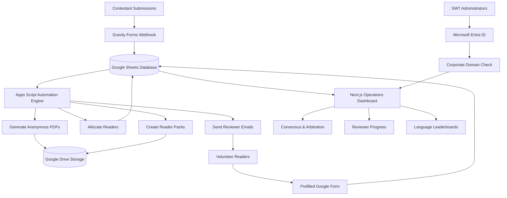

<div align="center">


# Words of the Wild - Operations Control Panel

</div>

> Secure, server-side operations dashboard built for the Scottish Wildlife Trust to manage a national writing competition across English, Scots and Gaelic.

> **Note**
>
> This repository is a public engineering case study. The production source code, deployment configuration and operational database remain in a private client repository.
>  > 
> **Confidentiality & Media Safeguards:** All visual diagrams, interface illustrations, and pipeline maps featured in this case study are **conceptual design mockups and system planning blueprints** created during requirements mapping. No active production databases, sensitive client credentials, or private volunteer data are exposed.


---

## Overview

Words of the Wild is an operational platform developed for the Scottish Wildlife Trust to replace manual spreadsheet-driven competition management with a secure, automated workflow.

The platform manages the complete judging process, from receiving submissions through to anonymisation, reader allocation, scoring, arbitration and final rankings.

The solution combines **Google Apps Script**, **Google Workspace** and a **Next.js operations dashboard** into a secure server-side architecture with Microsoft Entra ID authentication.

---

# Technology Stack


---

# System Architecture

The platform uses a background automation pipeline built in Google Apps Script, with Google Sheets acting as the operational database. The data is then consumed server-side by a secure Next.js dashboard.

The diagram below shows the full lifecycle of a submission, from entry through language-specific routing, reader pack generation, reviewer grading and administrator arbitration.




---


---
## Enterprise Security Model

To protect sensitive submission files, contact details and grading data, the application uses a dual-layer security model.

### 1. Microsoft Entra ID Tenant Locking

Authentication is managed through **NextAuth.js** using the Microsoft Entra ID provider.

Login requests are restricted to the Scottish Wildlife Trust's dedicated tenant. External organisations and personal Microsoft accounts (such as `@outlook.com` and `@hotmail.com`) are rejected before a user session is created.

---

### 2. Corporate Domain Validation

Authentication alone is not considered sufficient.

After a successful Microsoft sign-in, a second server-side validation checks the authenticated email address.

Only users with an authorised `@scottishwildlifetrust.org.uk` account are permitted access. All other authenticated users are denied before the application loads.

---

# Core Engineering Features

## Dynamic Reader Assignment & Language Prioritisation

Submissions are automatically categorised into:

- English
- Scots
- Gaelic

Because English-only readers cannot review Scots or Gaelic entries, the allocation engine prioritises bilingual readers before allocating English submissions.

The allocation engine also enforces the **three-reader fairness rule**, ensuring each story is assigned to three independent reviewers where capacity allows.


---

## Automated Reader Pack Assembly

Reader Packs are generated dynamically from a master Google Doc template.

Each personalised pack contains:

- 20 anonymous stories
- Anonymous PDF links
- Prefilled Google Form links
- Reader ID
- Story ID
- Assignment ID

Each feedback link is prepopulated with the correct identifiers, removing manual data entry and allowing responses to reconcile automatically with the correct assignment.

Completed Reader Packs are stored in Google Drive before being distributed through automated HTML email notifications.


---

## Operations & Consensus Centre

The dashboard provides live operational metrics including:

- Total submissions
- Registered volunteer readers
- Completed evaluations
- Language distribution
- Entries requiring arbitration

Reviewer decisions are automatically evaluated.

| Reader Outcome | System Result |
|---------------|---------------|
| **3 : 0** | Automatic consensus |
| **2 : 1** | Majority decision |
| **1 : 1 : 1** | Arbitration queue |
| **Majority "Not Sure"** | Staff review required |

---

## Reviewer Performance & Calibration

Reviewer activity is monitored continuously.

The dashboard highlights:

- Incomplete assignments
- Review completion rates
- Readers with no completed reviews
- Reviewer calibration
- Potential bottlenecks

Administrators can send reminder emails directly from the dashboard using dynamically generated `mailto:` links containing reviewer names, deadlines and assignment totals.

Reviewer strictness is calculated by comparing each reader's average score against the global average.

```text
Deviation = Reader Average − Global Average
```

Readers are classified as:

- 🟢 Balanced
- 🔵 Lenient
- 🔴 Strict

---

## Interactive User Experience

The dashboard includes several quality-of-life improvements for administrators.

- Persistent collapsible sidebar
- Microsoft Entra profile card
- Active session information
- Custom sign-out controls
- Maintenance mode (`NEXT_PUBLIC_COMING_SOON`)
- Protected OAuth callbacks during launch testing

---

# Impact & Outcomes

The completed platform replaced a manual spreadsheet-driven workflow with a secure operational dashboard.

## Manual Work Reduced

- Automated reader allocation
- Automated Reader Pack generation
- Automated document creation
- Automated notification emails

## Improved Data Integrity

Prefilled Google Forms removed manual entry of Reader IDs, Story IDs and Assignment IDs, significantly reducing transcription errors. Previosuly readers had to scroll through a 1000+ list dropdown menu to find the correct story title. I eliminated that, making their experience much easier and quicker. 

## Security Strengthened

The platform uses:

- Server-side API access
- Microsoft Entra ID authentication
- Corporate domain validation
- Zero client-side database credentials

## Faster Judging Process

Staff can now:

- Monitor competition progress in real time
- Identify inactive reviewers
- Review arbitration cases
- Track language-specific progress
- Manage the competition from a single operational dashboard

## Repository

This repository documents the architecture and engineering decisions behind the platform.

The production application, deployment configuration and client data remain private.

<div align="center">
  
### Contact & Development
**Nicola Berry**  
[Empower Automation](https://empowerautomation.co.uk)  
nicola@empowerautomation.co.uk  

</div>
